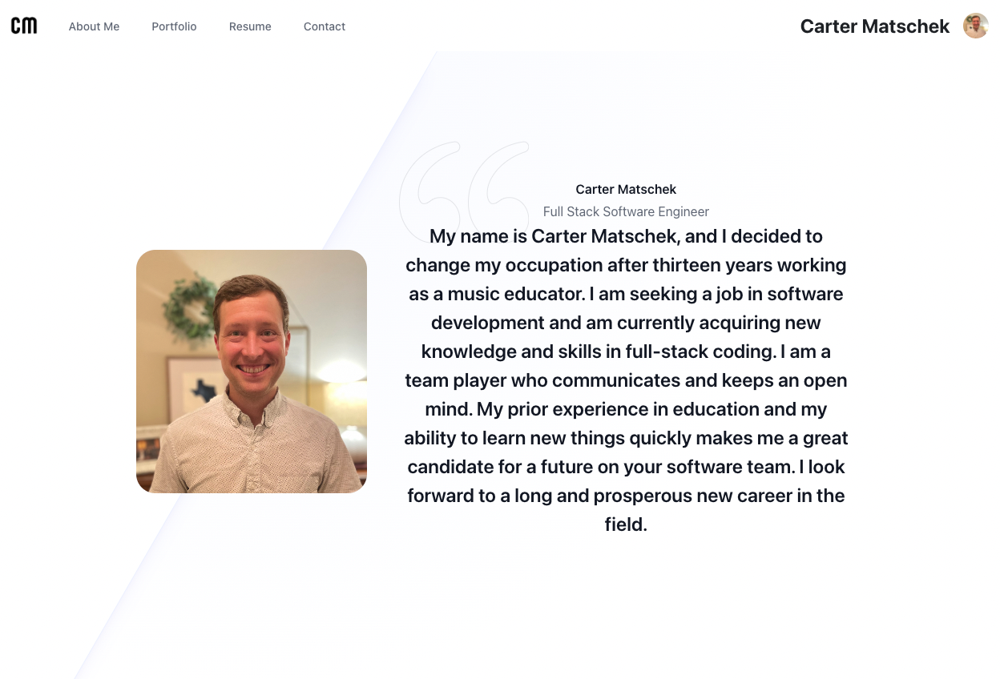

# Carter Matschek Portfolio
  
  ## Description
  This app is a personal portfolio featuring a bio, portfolio, resume, and contact info. It was created using React and will be further updated in the future.  
  Deployed link: 
  ## Table of Contents
  1. [Description](#description)
  2. [Installation](#installation)
  3. [Usage](#usage)
  4. [License](#license)  
 
    
  
  ## Usage
  This project features React as the front end framework.
  ## License
  [MIT](https://choosealicense.com/licenses/mit/)